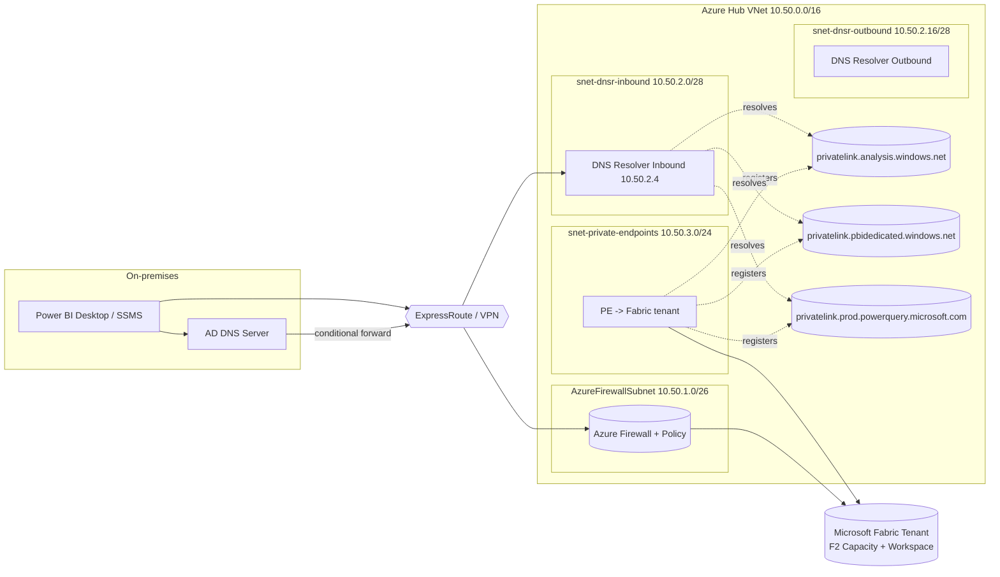

# Microsoft Fabric — Private VNet Demo (Terraform)

End-to-end Terraform sample that deploys a **Microsoft Fabric F2 capacity** behind a
**tenant-level Azure Private Link** with a **fully private VNet topology** (Azure
Firewall + Private DNS Resolver + private endpoints for OneLake / Warehouse / SQL
endpoint / Power BI). Designed for a **demo from on-premises** through ExpressRoute
or VPN, with the on-prem AD DNS forwarding to Azure Private DNS Resolver.

Includes two optional add-ons:

- **Simulated on-premises lab** ([`docs/lab-self-contained.md`](./docs/lab-self-contained.md)) — a peered VNet + Windows Server VM auto-promoted to a new AD DS forest with AD-integrated DNS and Fabric conditional forwarders. Lets you run the full DNS / firewall / private-endpoint demo end-to-end with no real ExpressRoute or VPN.
- **Managed Private Endpoints (MPEs)** ([`docs/managed-private-endpoints.md`](./docs/managed-private-endpoints.md)) + helper PowerShell that calls the Fabric REST API to wire Spark notebooks / lakehouses / eventstreams to private-only Storage / SQL DB / Cosmos / Key Vault.

> Scope: this stack is intentionally minimal for demo purposes. It uses an F2 SKU
> (lowest paid Fabric capacity) and a single hub VNet. Adapt the address space and
> firewall rules before reusing in production.

---

## 1. What gets deployed



Resources created:

| # | Resource | Purpose |
|---|----------|---------|
| 1 | `azurerm_resource_group` | Holds the demo stack |
| 2 | `azurerm_virtual_network` + 5 subnets | Hub VNet, Firewall, DNSR in/out, PE, jumpbox |
| 3 | `azurerm_fabric_capacity` (F2) | The Fabric capacity (SKU = F2, tier = Fabric) |
| 4 | `azapi_resource` (`Microsoft.PowerBI/privateLinkServicesForPowerBI`) | Tenant-level private link service binding |
| 5 | `azurerm_private_endpoint` (subresource `tenant`) | The PE that exposes Fabric in your VNet |
| 6 | 3 × `azurerm_private_dns_zone` + VNet links + A-record auto-registration | DNS for Fabric private link |
| 7 | `azurerm_private_dns_resolver` + inbound endpoint | Lets on-prem AD forward Fabric FQDNs into Azure |
| 8 | `azurerm_firewall_policy` + collections | Egress control with service tags & FQDN tags |
| 9 | `azurerm_firewall` (Standard, forced-tunneling friendly) | Inspects all outbound from spokes / on-prem |
| 10 | `snet-jumpbox` (empty subnet) | Slot for an optional jumpbox VM (BYO — MCAPS friendly) |

Workspace assignment to the F2 capacity is shown in `docs/post-deploy.md` (requires
Fabric tenant admin to flip the tenant-level **Azure Private Link** toggle once,
before PE creation succeeds end-to-end).

---

## 2. Prerequisites

- Terraform ≥ 1.6
- AzureRM provider ≥ 4.14 (introduces `azurerm_fabric_capacity`)
- AzAPI provider ≥ 2.0 (used for `Microsoft.PowerBI/privateLinkServicesForPowerBI`)
- Logged in to the **target subscription** with `az login`
- **Fabric tenant admin** rights to:
  - Enable tenant setting **Azure Private Link** (one-time, in Fabric admin portal)
  - Optionally enable **Block public Internet access** after smoke testing
- Capacity admin / contributor on the Azure subscription
- An Entra group object ID (preferred) or UPN list for `capacity_admin_members`

> The tenant-level toggle takes ~15 minutes to provision the FQDN on Microsoft's
> side. Apply Terraform first, then flip the toggle, then re-apply if the PE was
> stuck in `Pending` (it auto-recovers).

---

## 3. Quick start

```pwsh
# 1) Pick your subscription
az account set --subscription <SUB_ID>

# 2) Configure variables
Copy-Item terraform.tfvars.example terraform.tfvars
# edit terraform.tfvars: location, address_space, capacity name prefix, admin members

# 3) Deploy
terraform init
terraform plan  -out tfplan
terraform apply tfplan

# 4) Outputs to copy into on-prem DNS / Firewall change tickets
terraform output -json onprem_dns_forwarders
terraform output -json fabric_fqdns
```

---

## 4. On-premises Active Directory DNS forwarding

The Fabric tenant private FQDN follows the pattern:

```
<tenantId-without-hyphens>-api.privatelink.analysis.windows.net
<tenantId-without-hyphens>-onelake.privatelink.analysis.windows.net   # OneLake
<tenantId-without-hyphens>-warehouse.privatelink.analysis.windows.net # Warehouse
```

On-prem clients must resolve these to the **private IPs** that Azure Private DNS
holds. The recommended path is:

1. Deploy the **Azure Private DNS Resolver** (this Terraform does it).
2. Grab the **inbound endpoint IP** (Terraform output `dns_resolver_inbound_ip`,
   e.g. `10.50.2.4`).
3. On your on-prem AD DNS server, add **Conditional Forwarders** that forward
   each of the following zones to that IP:

   | Conditional forwarder zone | Forward-to IP |
   |---|---|
   | `privatelink.analysis.windows.net` | `<dns_resolver_inbound_ip>` |
   | `privatelink.pbidedicated.windows.net` | `<dns_resolver_inbound_ip>` |
   | `privatelink.prod.powerquery.microsoft.com` | `<dns_resolver_inbound_ip>` |
   | `analysis.windows.net` | `<dns_resolver_inbound_ip>` |
   | `pbidedicated.windows.net` | `<dns_resolver_inbound_ip>` |
   | `powerquery.microsoft.com` | `<dns_resolver_inbound_ip>` |
   | `fabric.microsoft.com` | `<dns_resolver_inbound_ip>` |
   | `powerbi.com` | `<dns_resolver_inbound_ip>` |

   PowerShell on a Windows DNS server (Server 2019/2022):

   ```powershell
   $resolverIp = '10.50.2.4'
   $zones = @(
     'privatelink.analysis.windows.net',
     'privatelink.pbidedicated.windows.net',
     'privatelink.prod.powerquery.microsoft.com',
     'analysis.windows.net',
     'pbidedicated.windows.net',
     'powerquery.microsoft.com',
     'fabric.microsoft.com',
     'powerbi.com'
   )
   foreach ($z in $zones) {
     Add-DnsServerConditionalForwarderZone `
       -Name $z `
       -MasterServers $resolverIp `
       -ReplicationScope Forest
   }
   ```

4. (Optional) If you have **split-horizon DNS** for `analysis.windows.net` already
   in use by another tenant, scope the forwarders to a delegated subdomain only —
   per the Fabric docs, only **one tenant** per network can be private-linked at
   a time.

Verify from an on-prem client:

```pwsh
nslookup <tenantIdNoHyphens>-api.privatelink.analysis.windows.net
# Must return a 10.50.3.x address (your PE subnet), NOT a public IP.
```

See `docs/on-prem-dns-forwarding.md` for BIND / Infoblox snippets.

---

## 5. Azure Firewall — service tags & FQDN tags

Once **Block Public Internet Access** is on at the tenant level, Fabric is only
reachable via the private endpoint, but Fabric still needs **outbound** access to
your data sources, AAD, etc. The firewall policy created here ships with the
following collections (priority shown in parentheses):

### Network rules (service tags)

| Rule | Source | Service tag(s) | Ports | Notes |
|---|---|---|---|---|
| `allow-aad` (200) | VNet / OnPrem | `AzureActiveDirectory` | TCP 443 | Sign-in & token |
| `allow-powerbi` (210) | VNet / OnPrem | `PowerBI` (regional) | TCP 443 | Power BI / Fabric portal & APIs |
| `allow-powerquery` (220) | VNet / OnPrem | `PowerQueryOnline` | TCP 443 | Mashup engine |
| `allow-datafactory` (230) | VNet / OnPrem | `DataFactory` (regional) | TCP 443 | Fabric Data Factory pipelines |
| `allow-fabric-sql` (240) | VNet / OnPrem | `Sql` (regional) | TCP 1433, 11000-11999 | Fabric Warehouse & SQL endpoint redirect range |
| `allow-eventhubs` (250) | VNet / OnPrem | `EventHub` (regional) | TCP 443, 5671-5672 | Real-time Intelligence |
| `allow-storage` (260) | VNet / OnPrem | `Storage` (regional) | TCP 443 | OneLake fallback / staging |
| `allow-monitor` (270) | VNet / OnPrem | `AzureMonitor` | TCP 443 | Diagnostics |

> Per the Fabric service tags doc, **DataFactory / EventHub / PowerBI / Sql** are
> regional. The module accepts a `home_region` and a list of `paired_regions` and
> emits one rule per (tag, region) combo so you stay compliant when capacity
> region differs from home region.

### Application rules (FQDNs not covered by service tags)

| Target | Reason |
|---|---|
| `*.fabric.microsoft.com` | Portal, item APIs |
| `*.powerbi.com` | Portal redirects |
| `*.analysis.windows.net` | XMLA / dataset endpoints |
| `*.pbidedicated.windows.net` | Capacity backend |
| `*.datawarehouse.fabric.microsoft.com` | Fabric Warehouse |
| `*.datamart.fabric.microsoft.com` | Datamart SQL |
| `*.database.fabric.microsoft.com` | Fabric SQL DB (also covered by `Sql` tag) |
| `*.powerquery.microsoft.com` | Power Query Online |
| `dc.services.visualstudio.com` | Service telemetry |
| `*.servicebus.windows.net` | Real-time events |
| `login.microsoftonline.com`, `login.windows.net`, `aadcdn.msftauth.net`, `*.msftidentity.com` | AAD (covered by service tag too — kept for explicit demo) |
| `*.events.data.microsoft.com` | Telemetry |

### FQDN tags

The Firewall Policy also enables built-in **FQDN tags**:
- `WindowsUpdate` (so the jumpbox stays patched)
- `WindowsDiagnostics`
- `MicrosoftActiveProtectionService`

> If your demo runs only the F2 capacity and a single workspace, you can disable
> the EventHub / DataFactory rules in `terraform.tfvars` to keep the rule count
> minimal.

See `docs/azure-firewall-rules.md` for the full table including direction,
description and the source ServiceTag overview link.

---

## 6. Folder layout

```
fabric-private-terraform/
├── README.md
├── .gitignore
├── versions.tf
├── providers.tf
├── variables.tf
├── main.tf
├── outputs.tf
├── terraform.tfvars.example
├── modules/
│   ├── network/
│   ├── dns/
│   ├── fabric-capacity/
│   ├── private-endpoint-fabric/
│   ├── firewall/
│   └── simulated-onprem/             # optional fake-on-prem AD DS lab
├── scripts/
│   └── fabric/
│       ├── Create-FabricMpe.ps1      # POST /workspaces/{id}/managedPrivateEndpoints
│       └── Get-FabricMpe.ps1
└── docs/
    ├── on-prem-dns-forwarding.md
    ├── azure-firewall-rules.md
    ├── post-deploy.md
    ├── test-from-onprem.md
    ├── lab-self-contained.md         # all-in-Azure demo flow
    └── managed-private-endpoints.md  # Fabric MPE workflow
```

---

## 7. References

- [Private links for Fabric tenants](https://learn.microsoft.com/fabric/security/security-private-links-overview)
- [Set up and use tenant-level private links](https://learn.microsoft.com/fabric/security/security-private-links-use)
- [Private endpoints for Power BI on-premises clients](https://learn.microsoft.com/fabric/enterprise/powerbi/service-security-private-links-on-premises)
- [Overview of managed private endpoints for Microsoft Fabric](https://learn.microsoft.com/fabric/security/security-managed-private-endpoints-overview)
- [Fabric REST API: Create workspace managed private endpoint](https://learn.microsoft.com/rest/api/fabric/core/managed-private-endpoints/create-workspace-managed-private-endpoint)
- [Fabric service tags](https://learn.microsoft.com/fabric/security/security-service-tags)
- [Power BI / Fabric allow-list URLs](https://learn.microsoft.com/fabric/security/power-bi-allow-list-urls)
- [`azurerm_fabric_capacity` resource](https://registry.terraform.io/providers/hashicorp/azurerm/latest/docs/resources/fabric_capacity)
- [Azure Private DNS Resolver](https://learn.microsoft.com/azure/dns/dns-private-resolver-overview)
